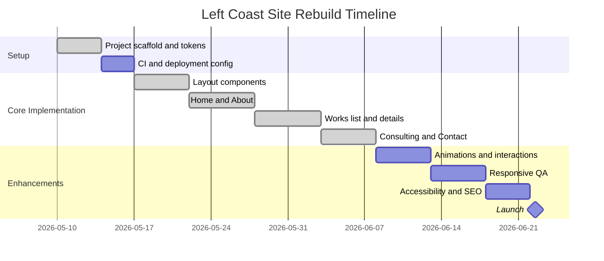

# Left Coast Design Studio Rebuild

Next.js App Router rebuild of `leftcoast.refractweb.com`, using Tailwind tokens and Aceternity-style patterns for hero parallax, logo cloud, stats, timeline, bento/card grids, tabs, and CTA sections.

## Stack

- Next.js 16 App Router
- React 19
- Tailwind CSS 4 tokens in `src/app/globals.css`
- Framer Motion for scroll reveals, hero transitions, counters, tabs, and card motion
- Lucide React for UI icons

## File Structure

```text
src/
  app/
    page.tsx
    about/page.tsx
    works/page.tsx
    works/[slug]/page.tsx
    consulting/page.tsx
    contact/page.tsx
    layout.tsx
    globals.css
    robots.ts
    sitemap.ts
  components/
    button-link.tsx
    contact-form-tabs.tsx
    feature-band.tsx
    footer.tsx
    hero-carousel.tsx
    logo-cloud.tsx
    navbar.tsx
    page-cta.tsx
    project-card.tsx
    reveal.tsx
    stats-block.tsx
    timeline.tsx
  lib/
    data.ts
    utils.ts
references/
  reference-*.html
```

## Design Tokens

Core tokens live in `src/app/globals.css`:

```css
:root {
  --color-bg: #f4f1ea;
  --color-text: #111111;
  --color-muted: #66625b;
  --color-accent: #c8a97e;
  --color-border: #d8d2c6;
  --radius-sm: 4px;
  --radius-md: 8px;
  --radius-lg: 16px;
  --shadow-sm: 0 1px 3px rgb(0 0 0 / 0.1);
  --shadow-md: 0 10px 30px rgb(0 0 0 / 0.12);
  --shadow-lg: 0 24px 80px rgb(0 0 0 / 0.22);
}
```

Breakpoints use Tailwind defaults: `sm 640`, `md 768`, `lg 1024`, `xl 1280`.

## Asset Strategy

The rebuild references the live reference assets:

- Logos and static media: `https://leftcoast.refractweb.com/_next/static/media/...`
- Project photography: Sanity CDN image URLs extracted from the live detail routes
- Logo marks: `https://leftcoast.refractweb.com/logos/...`

Production handoff can download these into `public/assets` and swap `ASSET_BASE` in `src/lib/data.ts`.

## Vanilla JS Fallbacks

### Slider

```js
let current = 0;
const slides = document.querySelectorAll("[data-slide]");
setInterval(() => {
  slides[current].classList.remove("active");
  current = (current + 1) % slides.length;
  slides[current].classList.add("active");
}, 5200);
```

### Counters

```js
document.querySelectorAll("[data-counter]").forEach((node) => {
  const target = Number(node.dataset.counter);
  const observer = new IntersectionObserver(([entry]) => {
    if (!entry.isIntersecting) return;
    let value = 0;
    const step = Math.max(1, Math.ceil(target / 80));
    const tick = () => {
      value = Math.min(target, value + step);
      node.textContent = value;
      if (value < target) requestAnimationFrame(tick);
    };
    tick();
    observer.disconnect();
  });
  observer.observe(node);
});
```

### Tabs

```js
document.querySelectorAll("[data-tab]").forEach((button) => {
  button.addEventListener("click", () => {
    document.querySelectorAll("[data-tab]").forEach((tab) => tab.classList.remove("active"));
    document.querySelectorAll("[data-panel]").forEach((panel) => panel.classList.remove("active"));
    button.classList.add("active");
    document.querySelector(`[data-panel="${button.dataset.tab}"]`).classList.add("active");
  });
});
```

## Accessibility and SEO

- One `h1` per route, semantic `header`, `nav`, `main`, `section`, `article`, `footer`
- Labels are associated with all form inputs, selects, and textareas
- Mobile nav uses `aria-expanded`, `aria-controls`, and keyboard-native buttons
- Contact tabs use `role="tablist"`, `role="tab"`, and `role="tabpanel"`
- Images have descriptive alt text, decorative duplicated logos are hidden
- Route metadata, Open Graph fields, `robots.ts`, and `sitemap.ts` are included

## QA Checklist

- `npm.cmd run build`
- Desktop: 1440x1000, 1280x800
- Tablet: 1024x768, 768x1024
- Mobile: 390x844, 430x932
- Check nav menu, hero autoplay, thumbnail selection, counters, scroll timeline, cards, contact tabs, and all work detail routes
- Confirm no horizontal overflow and no text overlap
- Lighthouse accessibility and SEO checks

## CI/CD Notes

Recommended GitHub Actions flow:

```yaml
name: CI
on: [push, pull_request]
jobs:
  build:
    runs-on: ubuntu-latest
    steps:
      - uses: actions/checkout@v4
      - uses: actions/setup-node@v4
        with:
          node-version: 22
          cache: npm
      - run: npm ci
      - run: npm run build
```

Deploy on Vercel with the default Next.js preset. No runtime environment variables are required for the static rebuild.

## Backlog

1. High: Replace remote asset references with locally optimized `public/assets` copies.
2. High: Wire contact forms to a production action or CRM endpoint.
3. High: Add visual regression screenshots for the six core routes.
4. Medium: Add category filtering on `/works`.
5. Medium: Add a lightbox for project galleries.
6. Low: Add CMS-backed project editing after content approval.

## Timeline


